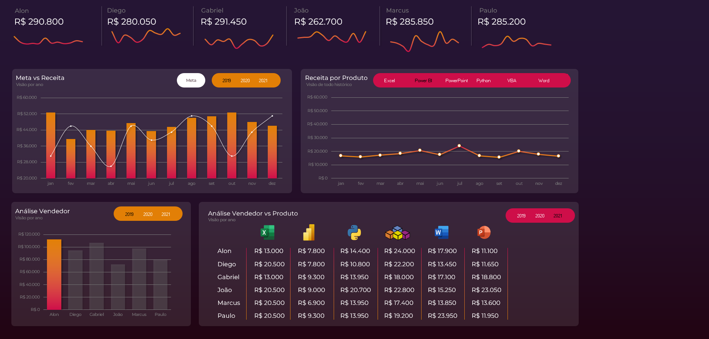
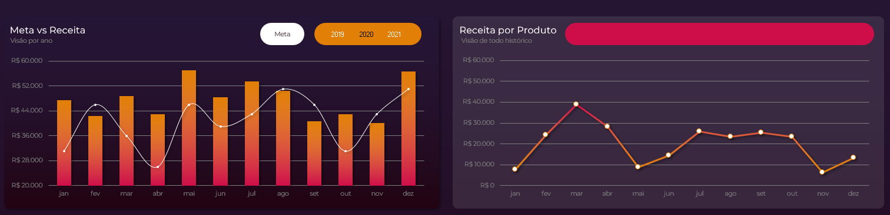
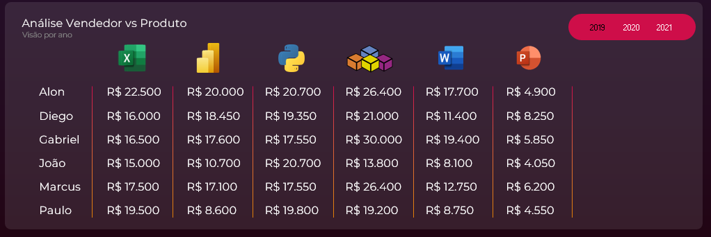

# Dashboard de Vendas em Excel  
Análise completa de vendas, metas e performance utilizando Excel como ferramenta de Data Analysis.

---

## 📊 Visão Geral

Este repositório apresenta um **Dashboard de Vendas** desenvolvido em Excel, focado em transformar dados brutos em informações claras, objetivas e úteis para tomada de decisão.

A construção deste dashboard envolveu:

- Tratamento e limpeza de dados  
- Estruturação de métricas essenciais  
- Criação de análises de vendas, metas e performance  
- Uso de tabelas e gráficos para favorecer a leitura  
- Design pensado para clareza e eficiência  

O objetivo principal foi demonstrar como **boas práticas em Excel** podem gerar insights reais para áreas como Vendas, BI, Operações e Análise de Dados.

---

## 🧠 Objetivo do Projeto

Este projeto tem como propósito mostrar, na prática:

- Capacidade de trabalhar com bases brutas  
- Competência em estruturar dados para análise  
- Entendimento de KPIs e indicadores de performance  
- Construção de dashboards funcionais e intuitivos  
- Aplicação de boas práticas visuais  

Ele faz parte da minha trilha de evolução em Dados, passando por:

**Excel → SQL → Power BI → Projetos Analíticos**

---

## 🗂 Estrutura do Arquivo Excel

O arquivo `dashboard-vendas-final.xlsx` contém:

- **Dados Brutos** — base original sem tratamento  
- **Dados Tratados** — limpeza, padronização e estruturação  
- **Dashboard Final** — gráficos, indicadores e layout final  

---

## 🖼 Visualizações do Dashboard

### **1. Visão Geral**

---

### **2. Gráficos de Meta, Receita e Produtos**

---

### **3. Análise por Vendedor x Produto**

---

## 🛠 Ferramentas e Técnicas Utilizadas

- Microsoft Excel  
- Funções e fórmulas para tratamento de dados  
- Tabelas dinâmicas  
- Gráficos personalizados  
- Estruturação visual orientada à leitura  
- Noções de layout aplicado a dashboards  

---

## 🚀 Próximos Passos na Trilha de Dados

Este projeto abre caminho para as próximas etapas:

- Aprimorar análises e visualizações no Excel  
- Avançar em **SQL** para consultas e modelagem  
- Criar dashboards interativos no **Power BI**  
- Desenvolver projetos completos unindo negócio + dados  
- Consolidar portfólio profissional no GitHub  

---

## 🔗 Post no LinkedIn

Publicação completa sobre este projeto:  
https://www.linkedin.com/posts/fabianoferreira-bi_excel-anaerlisededados-bi-activity-7398517965131792384-79ax

---

## 👨‍💻 Autor

**Fabiano Ferreira**  
LinkedIn: https://www.linkedin.com/in/fabianoferreira-bi  
GitHub: https://github.com/Fabianogf12  

Caso queira trocar ideias sobre o projeto ou discutir práticas de análise, estou à disposição.
